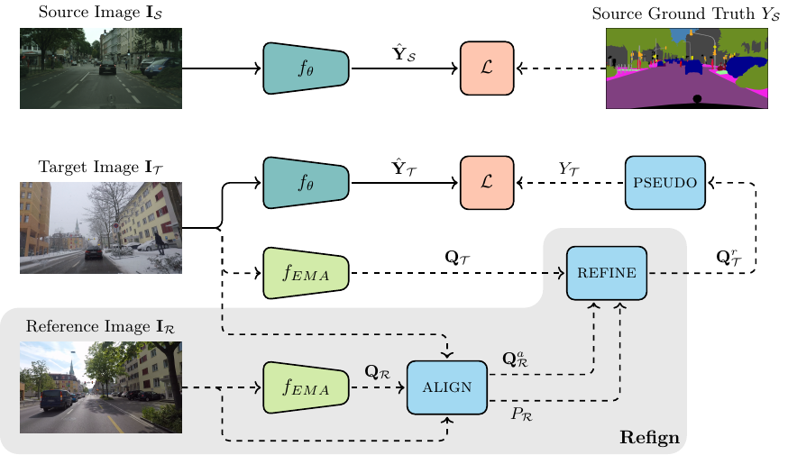

 ---

<div align="center">    
 
# Refign: Align and Refine for Adaptation of Semantic Segmentation to Adverse Conditions

[](https://arxiv.org/abs/2207.06825)
[](https://wacv2023.thecvf.com/) 

[](https://paperswithcode.com/sota/domain-adaptation-on-cityscapes-to-acdc?p=refign-align-and-refine-for-adaptation-of)

[](https://paperswithcode.com/sota/semantic-segmentation-on-dark-zurich?p=refign-align-and-refine-for-adaptation-of)

</div>

This repository provides the official code for the WACV 2023 paper [Refign: Align and Refine for Adaptation of Semantic Segmentation to Adverse Conditions](https://arxiv.org/abs/2207.06825). The code is organized using [PyTorch Lightning](https://github.com/Lightning-AI/lightning). 

🔥 [September 2, 2022] Applied on top of [HRDA](https://github.com/lhoyer/HRDA), Refign ranks #1 on both the [ACDC leaderboard](https://acdc.vision.ee.ethz.ch/benchmarks#semanticSegmentation)—**72.05 mIoU**—and the [Dark Zurich leaderboard](https://codalab.lisn.upsaclay.fr/competitions/3783#results)—**63.91 mIoU**. See below for training configurations.



## Abstract

Due to the scarcity of dense pixel-level semantic annotations for images recorded in adverse visual conditions, there has been a keen interest in unsupervised domain adaptation (UDA) for the semantic segmentation of such images. UDA adapts models trained on normal conditions to the target adverse-condition domains.
Meanwhile, multiple datasets with driving scenes provide corresponding images of the same scenes across multiple conditions, which can serve as a form of weak supervision for domain adaptation.
We propose Refign, a generic extension to self-training-based UDA methods which leverages these cross-domain correspondences.
Refign consists of two steps:
(1) aligning the normal-condition image to the corresponding adverse-condition image using an uncertainty-aware dense matching network, and
(2) refining the adverse prediction with the normal prediction using an adaptive label correction mechanism.
We design custom modules to streamline both steps and set the new state of the art for domain-adaptive semantic segmentation on several adverse-condition benchmarks, including ACDC and Dark Zurich.
The approach introduces no extra training parameters, minimal computational overhead—during training only—and can be used as a drop-in extension to improve any given self-training-based UDA method.


## Usage
### Requirements

The code is run with Python 3.8.13. To install the packages, use:
```bash
pip install -r requirements.txt
```

### Set Data Directory

The following environment variable must be set:
```bash
export DATA_DIR=/path/to/data/dir
```

### Download the Data

Before running the code, download and extract the corresponding datasets to the directory `$DATA_DIR`.

#### UDA
<details>
  <summary>Cityscapes</summary>
  
  Download leftImg8bit_trainvaltest.zip and gt_trainvaltest.zip from [here](https://www.cityscapes-dataset.com/downloads/) and extract them to `$DATA_DIR/Cityscapes`.

  ```
  $DATA_DIR
  ├── Cityscapes
  │   ├── leftImg8bit
  │   │   ├── train
  │   │   ├── val
  │   ├── gtFine
  │   │   ├── train
  │   │   ├── val
  ├── ...
  ```
  Afterwards, run the preparation script:
  ```bash
  python tools/convert_cityscapes.py $DATA_DIR/Cityscapes
  ```
</details>

<details>
  <summary>ACDC</summary>
  
  Download rgb_anon_trainvaltest.zip and gt_trainval.zip from [here](https://acdc.vision.ee.ethz.ch/download) and extract them to `$DATA_DIR/ACDC`.

  ```
  $DATA_DIR
  ├── ACDC
  │   ├── rgb_anon
  │   │   ├── fog
  │   │   ├── night
  │   │   ├── rain
  │   │   ├── snow
  │   ├── gt
  │   │   ├── fog
  │   │   ├── night
  │   │   ├── rain
  │   │   ├── snow
  ├── ...
  ```
</details>

<details>
  <summary>Dark Zurich</summary>
  
  Download Dark_Zurich_train_anon.zip, Dark_Zurich_val_anon.zip, and Dark_Zurich_test_anon_withoutGt.zip from [here](https://www.trace.ethz.ch/publications/2019/GCMA_UIoU/) and extract them to `$DATA_DIR/DarkZurich`.

  ```
  $DATA_DIR
  ├── DarkZurich
  │   ├── rgb_anon
  │   │   ├── train
  │   │   ├── val
  │   │   ├── val_ref
  │   │   ├── test
  │   │   ├── test_ref
  │   ├── gt
  │   │   ├── val
  ├── ...
  ```
</details>

<details>
  <summary>Nighttime Driving</summary>
  
  Download NighttimeDrivingTest.zip from [here](http://people.ee.ethz.ch/~daid/NightDriving/) and extract it to `$DATA_DIR/NighttimeDrivingTest`.

  ```
  $DATA_DIR
  ├── NighttimeDrivingTest
  │   ├── leftImg8bit
  │   │   ├── test
  │   ├── gtCoarse_daytime_trainvaltest
  │   │   ├── test
  ├── ...
  ```
</details>

<details>
  <summary>BDD100k-night</summary>
  
  Download `10k Images` and `Segmentation` from [here](https://bdd-data.berkeley.edu/portal.html#download) and extract them to `$DATA_DIR/bdd100k`.

  ```
  $DATA_DIR
  ├── bdd100k
  │   ├── images
  │   │   ├── 10k
  │   ├── labels
  │   │   ├── sem_seg
  ├── ...
  ```
</details>

<details>
  <summary>RobotCar for Segmentation</summary>
  
  Download all data from [here](https://data.ciirc.cvut.cz/public/projects/2020VisualLocalization/Cross-Seasons-Correspondence/ROBOTCAR/) and save them to `$DATA_DIR/RobotCar`. As mentioned in the corresponding README.txt, the images must be downloaded from [this link](https://drive.google.com/drive/folders/19yUB49EliCnWThuN2HUukIryX47JWmQp).

  ```
  $DATA_DIR
  ├── RobotCar
  │   ├── images
  │   │   ├── dawn
  │   │   ├── dusk
  │   │   ├── night
  │   │   ├── night-rain
  │   │   ├── ...
  │   ├── correspondence_data
  │   │   ├── ...
  │   ├── segmented_images
  │   │   ├── training
  │   │   ├── validation
  │   │   ├── testing
  ├── ...
  ```
</details>


#### Alignment

<details>
  <summary>MegaDepth</summary>
  
  For training, we use the version provided by the [D2-Net repo](https://github.com/mihaidusmanu/d2-net). Follow their instructions for downloading and preprocessing the dataset.

  For testing, we use the split provided by [RANSAC-Flow here](https://github.com/XiSHEN0220/RANSAC-Flow/tree/master/evaluation/evalCorr).
  The directories `MegaDepth_Train`, `MegaDepth_Train_Org`, and `Val` can be removed.

  All in all, the folder structure should look as follows:
  ```
  $DATA_DIR
  ├── MegaDepth
  │   ├── Undistorted_SfM
  │   │   ├── ...
  │   ├── scene_info
  │   │   ├── ...
  │   ├── Test
  │   │   ├── test1600Pairs
  │   │   |   ├── ...
  │   │   ├── test1600Pairs.csv
  ├── ...
  ```
</details>

<details>
  <summary>RobotCar for Matching</summary>
  
  We use the correspondence file provided by [RANSAC-Flow here](https://drive.google.com/file/d/16mZLUKsjceAt1RTW1KLckX0uCR3O4x5Q/view).
  If not already downloaded for segmentation, download the images from [here](https://drive.google.com/drive/folders/19yUB49EliCnWThuN2HUukIryX47JWmQp).

  ```
  $DATA_DIR
  ├── RobotCar
  │   ├── images
  │   │   ├── dawn
  │   │   ├── dusk
  │   │   ├── night
  │   │   ├── night-rain
  │   │   ├── ...
  │   ├── test6511.csv
  ├── ...
  ```
</details>


### Pretrained Models and Results

We provide pretrained models of both UDA and alignment networks.
Note that the UAWarpC checkpoint is needed to train Refign. To avoid config file edits, save it to `./pretrained_models/`.
To facilitate qualitative segmentation comparisons, validation set predictions of Refign can be directly downloaded. Starred models use Cityscapes pretrained weights in the backbone, the others ImageNet pretrained.

#### UDA

| Model         | Task           | Test Set       | Test Score    | Config      |  Checkpoint    |   Predictions  |
|---------------|----------------|-----------------|-----------------|------------|----------------|------------|
| Refign-DAFormer | Cityscapes→ACDC | ACDC test | 65.5 mIoU | [config](https://github.com/brdav/refign/blob/main/configs/cityscapes_acdc/refign_daformer.yaml) | [model](https://data.vision.ee.ethz.ch/brdavid/refign/refign_daformer_acdc.ckpt) | [ACDC val](https://data.vision.ee.ethz.ch/brdavid/refign/colored_preds_val_ACDC_refign_daformer.zip) 
| Refign-HRDA* | Cityscapes→ACDC | ACDC test | 72.1 mIoU | [config](https://github.com/brdav/refign/blob/main/configs/cityscapes_acdc/refign_hrda_star.yaml) | [model](https://data.vision.ee.ethz.ch/brdavid/refign/refign_hrda_star_acdc.ckpt) | [ACDC val](https://data.vision.ee.ethz.ch/brdavid/refign/colored_preds_val_ACDC_refign_hrda_star.zip)
|||||||
| Refign-DAFormer | Cityscapes→Dark Zurich | Dark Zurich test | 56.2 mIoU | [config](https://github.com/brdav/refign/blob/main/configs/cityscapes_darkzurich/refign_daformer.yaml) | [model](https://data.vision.ee.ethz.ch/brdavid/refign/refign_daformer_darkzurich.ckpt) | [Dark Zurich val](https://data.vision.ee.ethz.ch/brdavid/refign/colored_preds_val_DarkZurich_refign_daformer.zip)
| Refign-HRDA* | Cityscapes→Dark Zurich | Dark Zurich test | 63.9 mIoU | [config](https://github.com/brdav/refign/blob/main/configs/cityscapes_darkzurich/refign_hrda_star.yaml) | [model](https://data.vision.ee.ethz.ch/brdavid/refign/refign_hrda_star_darkzurich.ckpt) | [Dark Zurich val](https://data.vision.ee.ethz.ch/brdavid/refign/colored_preds_val_DarkZurich_refign_hrda_star.zip)
|||||||
| Refign-DAFormer | Cityscapes→RobotCar | RobotCar Seg. test       | 60.5 mIoU | [config](https://github.com/brdav/refign/blob/main/configs/cityscapes_robotcar/refign_daformer.yaml) | [model](https://data.vision.ee.ethz.ch/brdavid/refign/refign_daformer_robotcar.ckpt)  | [RobotCar val](https://data.vision.ee.ethz.ch/brdavid/refign/colored_preds_val_RobotCar_refign_daformer.zip)

#### Alignment
| Model         | Task           | Test Set       | Score    | Config      |  Checkpoint    |
|---------------|----------------|-----------------|-----------------|------------|----------------|
| UAWarpC | MegaDepth Dense Matching | RobotCar Matching test | 36.8 PCK-5 | [stage1](https://github.com/brdav/refign/blob/main/configs/megadepth/uawarpc_stage1.yaml), [stage2](https://github.com/brdav/refign/blob/main/configs/megadepth/uawarpc_stage2.yaml) | [model](https://data.vision.ee.ethz.ch/brdavid/refign/uawarpc_megadepth.ckpt) | 


### Refign Training

Make sure to first download the trained UAWarpC model with the link provided above.
Enter the path to the UAWarpC model for `model.init_args.alignment_head.init_args.pretrained` in the config file you intend to run (or save the model to `./pretrained_models/`).

To train Refign on ACDC (single GPU, with AMP) use the following command:

```bash
python tools/run.py fit --config configs/cityscapes_acdc/refign_hrda_star.yaml --trainer.gpus 1 --trainer.precision 16
```

Similar config files are available for Dark Zurich and RobotCar.
We also provide the config files for reproducing the ablation study in `configs/cityscapes_acdc/ablations/`.

### Refign Testing

As mentioned in the previous section, modify the config file by adding the UAWarpC model path.
To evaluate Refign e.g. on the ACDC validation set, use the following command:

```bash
python tools/run.py test --config configs/cityscapes_acdc/refign_hrda_star.yaml --ckpt_path /path/to/trained/model --trainer.gpus 1
```

We also provide pretrained models, which can be downloaded from the link above. To evaluate them, simply provide them as the argument `--ckpt_path`.

To get test set scores for ACDC and DarkZurich, predictions are evaluated on the respective evaluation servers: [ACDC](https://acdc.vision.ee.ethz.ch/submit) and [DarkZurich](https://codalab.lisn.upsaclay.fr/competitions/3783).
To create and save test predictions for e.g. ACDC, use this command:
```bash
python tools/run.py predict --config configs/cityscapes_acdc/refign_hrda_star.yaml --ckpt_path /path/to/trained/model --trainer.gpus 1
```

### UAWarpC Training

Alignment training consists of two stages. To train stage 1 use:
```bash
python tools/run.py fit --config configs/megadepth/uawarpc_stage1.yaml --trainer.gpus 1 --trainer.precision 16
```

Afterwards, launch stage 2, providing the path of the last checkpoint of stage 1 as an argument:
```bash
python tools/run.py fit --config configs/megadepth/uawarpc_stage2.yaml --model.init_args.pretrained /path/to/last/ckpt/of/stage1 --trainer.gpus 1 --trainer.precision 16
```

Training of the alignment network takes several days on a single GPU.

### UAWarpC Testing

We use a separate config file for evaluation, to avoid the lengthy sampling of MegaDepth training data at that stage. But of course, the config file used for training can be used as well.

```bash
python tools/run.py test --config configs/megadepth/uawarpc_evalonly.yaml --ckpt_path /path/to/last/ckpt/of/stage2 --trainer.gpus 1
```

We also provide a pretrained model, which can be downloaded from the link above. To test it, simply provide it as the argument `--ckpt_path`.


## Local Correlation

Local correlation is implemented through [this custom CUDA extension](https://github.com/ClementPinard/Pytorch-Correlation-extension). By default the extension is built just in time. In case there are problems with this mechanism, the extension can be alternatively pre-installed in the environment (see also the README of the linked repo):
```bash
pip install spatial-correlation-sampler
```


## How to Add Refign to your Self-Training UDA Code

Check the `training_step` method in `models/segmentation_model.py`. You will need to implement similar logic as is called when the `use_refign` attribute is `True`. In particular, you also need methods `align` and `refine`, located in the same file (and the full alignment network). Of course, the dataloader must also return a reference image for Refign to work.


## Citation

If you find this code useful in your research, please consider citing the paper:
```bibtex
@inproceedings{bruggemann2022refign,
  title={Refign: Align and Refine for Adaptation of Semantic Segmentation to Adverse Conditions},
  author={Bruggemann, David and Sakaridis, Christos and Truong, Prune and Van Gool, Luc},
  booktitle={WACV},
  year={2023}
}
```

## Credit

The pretrained backbone weights and code are from [MMSegmentation](https://github.com/open-mmlab/mmsegmentation). DAFormer code is from the [original repo](https://github.com/lhoyer/DAFormer). Geometric matching code is from [this repo](https://github.com/PruneTruong/DenseMatching). Local correlation CUDA code is from [this repo](https://github.com/ClementPinard/Pytorch-Correlation-extension).

## Contact

For questions about the code or paper, feel free to contact me ([send email](mailto:brdavid@vision.ee.ethz.ch)).